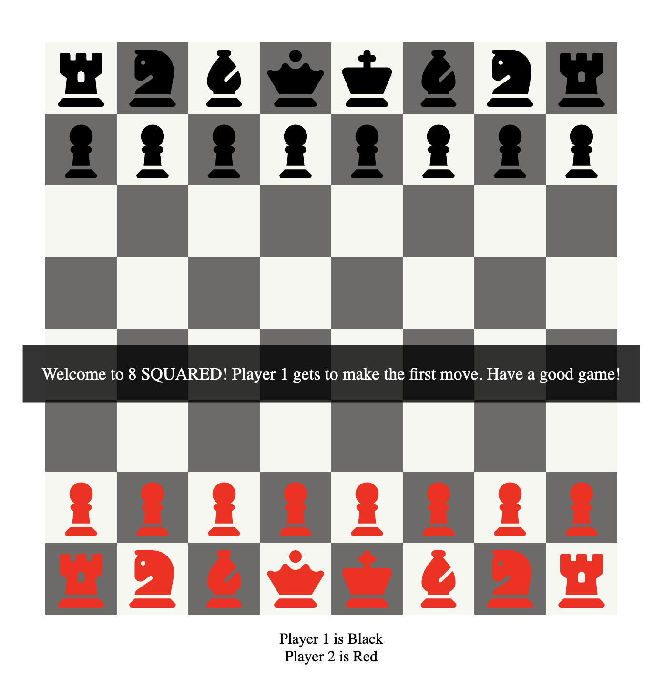

# 8 SQUARED 

## About

8 SQUARED is a chess-like game developed using HTML, CSS, and JavaScript, allowing players to enjoy a simplified chess experience.

## Features

- Drag-and-drop functionality for moving pieces.
- Initial implementation of basic chess rules for pawns, knights, rooks, and more.
- Dynamic player switching and turn display after each move.

## Turn Display

After every move, the game indicates whose turn it is. The display alternates between Player 1 and Player 2 (or Black and Red, based on your settings).

## Getting Started

To run the game locally:

1. Clone this repository.
2. Open `index.html` in your preferred web browser.
